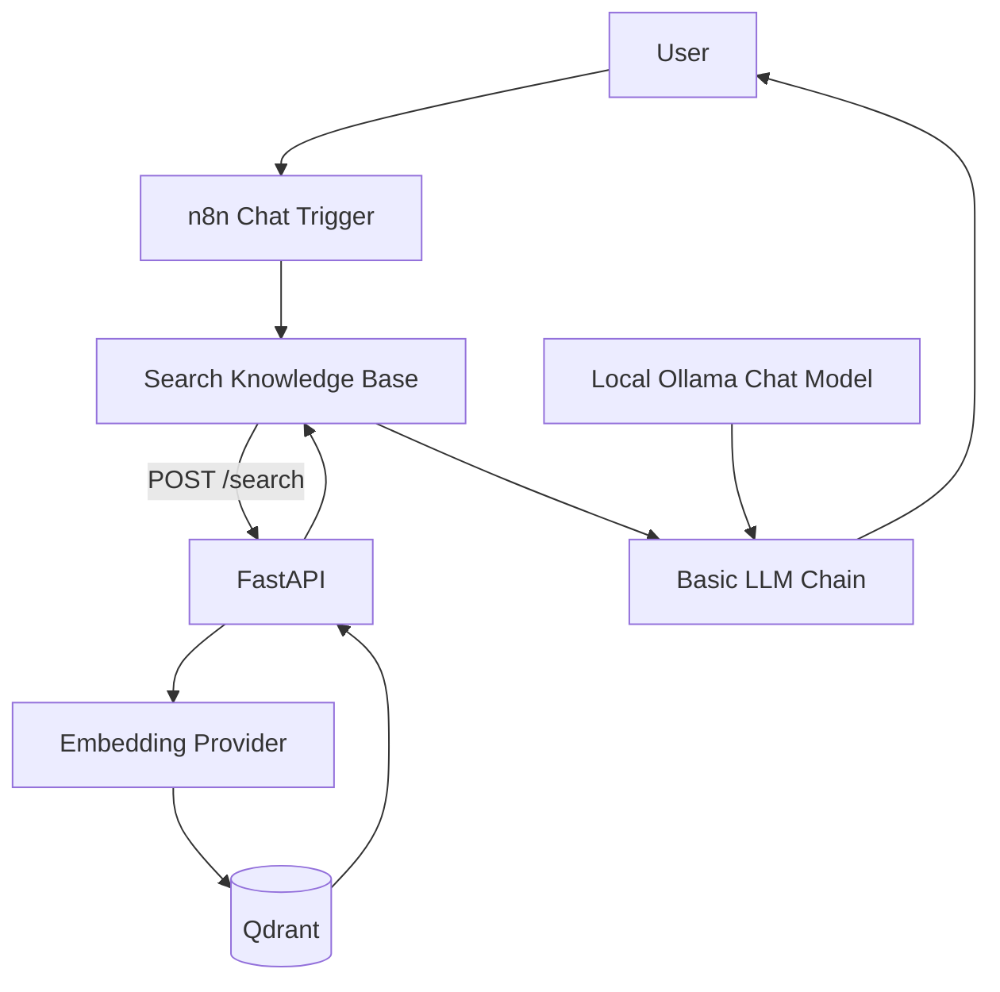

# DocuAgent - RAG Knowledge Assistant with n8n

DocuAgent is a small, explicit Retrieval-Augmented Generation (RAG) portfolio project. A FastAPI backend extracts text from PDF files, creates embeddings, stores document chunks in Qdrant, and exposes semantic retrieval through a REST API. An n8n workflow retrieves context before every model call and uses a Basic LLM Chain to generate the final cited answer.

The default setup is local-first and free to run with Ollama. OpenAI embeddings remain available as an optional provider without changing the retrieval pipeline.

## Why this project

This MVP demonstrates practical experience with Python, FastAPI, embeddings, vector search, Qdrant, REST APIs, local LLMs, n8n orchestration, Docker, and automated testing. The implementation avoids framework-heavy abstractions so each RAG step is easy to inspect and explain.

## Architecture



The Python backend performs document ingestion and retrieval only. It does not generate the final conversational answer. Retrieval is deterministic: n8n calls `/search` before every LLM invocation so document grounding does not depend on the model choosing a tool.

## Features

- PDF upload with page-by-page text extraction
- Overlapping character-based chunking with page metadata
- Local Ollama embeddings by default (`embeddinggemma`)
- Optional OpenAI embeddings through environment configuration
- Cosine-similarity vector search in Qdrant
- Search results containing text, source filename, page, and score
- FastAPI validation and meaningful HTTP errors
- Batch ingestion CLI for local PDF files
- Docker Compose stack for FastAPI, persistent Qdrant, and persistent n8n
- Importable deterministic n8n RAG workflow and reusable answer prompt
- Automated tests using deterministic embeddings and Qdrant local mode

## RAG pipeline

### Ingestion

```text
PDF upload
  -> extract text per page
  -> split each page into overlapping chunks
  -> create embeddings
  -> store vectors and metadata in Qdrant
```

### Retrieval

```text
user query
  -> create query embedding with the same model
  -> Qdrant cosine similarity search
  -> return ranked chunks with source and page metadata
  -> n8n Basic LLM Chain generates the final cited answer
```

## Tech stack

| Area | Technology |
| --- | --- |
| API | Python 3.11, FastAPI, Uvicorn, Pydantic |
| Embeddings | Ollama or OpenAI Python SDK |
| Vector database | Qdrant |
| PDF extraction | pypdf |
| Workflow orchestration | n8n Basic LLM Chain |
| Package manager | uv |
| Deployment | Docker, Docker Compose |
| Testing | pytest, FastAPI TestClient, Qdrant local mode |

## Project structure

```text
docuagent-rag-n8n/
├── app/
│   ├── api/                 # Health, upload, and search endpoints
│   ├── core/                # Settings and logging
│   ├── schemas/             # Pydantic request/response models
│   ├── services/            # PDF, chunking, embeddings, Qdrant, RAG
│   └── main.py              # FastAPI application
├── data/documents/          # Local test PDFs (ignored by Git)
├── n8n/                    # Setup guide and importable workflow JSON
├── prompts/                 # RAG answer and optional agent prompts
├── scripts/                 # Batch ingestion CLI
├── screenshots/             # Portfolio screenshots
├── tests/                   # Lightweight automated tests
├── Dockerfile
├── docker-compose.yml
├── pyproject.toml
└── uv.lock
```

## Quick start with Docker Compose

### Prerequisites

- Docker Desktop with Docker Compose
- Ollama installed on the host for the free local setup
- `embeddinggemma` downloaded in Ollama

Prepare Ollama:

```powershell
ollama pull embeddinggemma
ollama serve
```

If the Ollama desktop application is already running, a second `ollama serve` process is not required.

Create local configuration and start the stack:

```powershell
Copy-Item .env.example .env
docker compose up --build -d
```

The Compose stack starts:

- FastAPI: <http://localhost:8000>
- Swagger UI: <http://localhost:8000/docs>
- Qdrant dashboard: <http://localhost:6333/dashboard>
- n8n editor: <http://localhost:5678>

Verify the API:

```powershell
Invoke-RestMethod http://localhost:8000/health
```

Stop the containers without deleting indexed vectors:

```powershell
docker compose down
```

Qdrant data is stored in the named volume `docuagent-rag-n8n_qdrant_storage`. n8n settings and workflows are stored in `docuagent-rag-n8n_n8n_data`.

## Local development with uv

Synchronize the locked environment:

```powershell
py -3.11 -m uv sync
```

Start Qdrant only:

```powershell
docker compose up -d qdrant
```

Copy `.env.example` to `.env`. Local uv runs should use:

```env
OLLAMA_BASE_URL=http://localhost:11434
QDRANT_URL=http://localhost:6333
```

Start FastAPI:

```powershell
py -3.11 -m uv run uvicorn app.main:app --reload
```

## API usage

| Method | Endpoint | Purpose |
| --- | --- | --- |
| `GET` | `/health` | Confirm that FastAPI is available |
| `POST` | `/documents/upload` | Extract, chunk, embed, and index one PDF |
| `POST` | `/search` | Return semantically relevant document chunks |

### Upload a PDF

```powershell
curl.exe -X POST `
  -F "file=@data/documents/nist-ai-rmf-1.0.pdf;type=application/pdf" `
  http://localhost:8000/documents/upload
```

Example response:

```json
{
  "filename": "nist-ai-rmf-1.0.pdf",
  "chunks_created": 150,
  "status": "indexed"
}
```

### Search the knowledge base

```powershell
$body = @{
    query = "What are the four core functions of the NIST AI RMF?"
    top_k = 4
} | ConvertTo-Json

Invoke-RestMethod `
  -Method Post `
  -Uri "http://localhost:8000/search" `
  -ContentType "application/json" `
  -Body $body
```

Example response:

```json
{
  "query": "What are the four core functions of the NIST AI RMF?",
  "results": [
    {
      "text": "Relevant document context...",
      "source": "nist-ai-rmf-1.0.pdf",
      "page": 25,
      "score": 0.68
    }
  ]
}
```

`/search` never calls a chat model. It returns context for the n8n workflow.

### Batch ingestion

Index every PDF currently stored in `data/documents`:

```powershell
py -3.11 -m uv run python -m scripts.ingest_documents
```

Or pass explicit paths:

```powershell
py -3.11 -m uv run python -m scripts.ingest_documents `
  data/documents/nist-ai-rmf-1.0.pdf `
  data/documents/etda-ai-governance-business-th.pdf
```

## Embedding providers

### Ollama (default, local)

```env
EMBEDDING_PROVIDER=ollama
OLLAMA_EMBEDDING_MODEL=embeddinggemma
```

### OpenAI (optional, paid API)

```env
EMBEDDING_PROVIDER=openai
OPENAI_API_KEY=your_key_here
OPENAI_EMBEDDING_MODEL=text-embedding-3-small
```

Documents and queries must use the same embedding provider and model. When switching models, use a new `QDRANT_COLLECTION` name so vectors with different dimensions or embedding spaces are never mixed.

## n8n integration

n8n is included in the Compose stack with a persistent `n8n_data` volume. The first visit to <http://localhost:5678> opens the local owner-account setup screen.

The Version 1 workflow is deterministic:

```text
Chat Trigger
     |
     v
Search Knowledge Base -- POST http://api:8000/search
     |
     v
Basic LLM Chain ----- Local Ollama Chat Model
```

Import [n8n/workflows/docuagent-deterministic-rag.json](n8n/workflows/docuagent-deterministic-rag.json), select the local Ollama credential in the chat-model node, and test the workflow. The export intentionally contains no credential IDs or secrets.

Detailed configuration and troubleshooting are documented in [n8n/SETUP.md](n8n/SETUP.md). The chain prompt is stored in [prompts/rag_answer_prompt.txt](prompts/rag_answer_prompt.txt).

### Why the workflow does not use AI Agent by default

The original prototype used an HTTP Request Tool connected to n8n AI Agent v3.1. With the tested local `mistral:latest` model, the model sometimes printed a tool call as plain JSON instead of emitting a structured tool call, so retrieval was skipped. Since every question in this MVP is document-based, explicitly retrieving first is simpler and more reliable. The original agent prompt remains available in [prompts/agent_system_prompt.txt](prompts/agent_system_prompt.txt) for optional experiments with a model verified to support structured tool calls through n8n.

## Example questions

- `What are the four core functions of the NIST AI RMF?`
- `How do RAG-Sequence and RAG-Token differ?`
- `องค์กรควรจัดโครงสร้างการบริหารภายในเพื่อกำกับดูแล AI อย่างไร?`
- `Which document and page support your answer?`

The test document sources and checksums are recorded in [data/documents/SOURCES.md](data/documents/SOURCES.md).

## Tests

```powershell
py -3.11 -m uv run pytest -q
```

The suite covers PDF extraction, chunking, metadata preservation, embedding provider behavior, Qdrant storage and retrieval, upload/search validation, service error mapping, API health, and batch file discovery.

## Troubleshooting

### FastAPI cannot reach Ollama

- Local uv run: use `OLLAMA_BASE_URL=http://localhost:11434`.
- FastAPI in Docker: Compose uses `OLLAMA_DOCKER_BASE_URL=http://host.docker.internal:11434`.
- Confirm the model exists with `ollama list`.

### FastAPI cannot reach Qdrant

- Local uv run: use `QDRANT_URL=http://localhost:6333`.
- Compose: `QDRANT_URL` is automatically set to `http://qdrant:6333`.
- Confirm Docker Desktop is running and open <http://localhost:6333/dashboard>.

### Vector dimension mismatch

The indexed documents were created with a different embedding model. Set a new collection name, for example `QDRANT_COLLECTION=docuagent_openai`, and ingest the documents again.

### A PDF produces little or no text

Version 1 supports embedded PDF text only. Scanned documents require OCR, which is intentionally outside this MVP.

## Screenshots

Capture these after importing the clean workflow and completing the manual test:

| Screenshot | Suggested file |
| --- | --- |
| FastAPI Swagger endpoints | `screenshots/swagger-api.png` |
| Qdrant collection and points | `screenshots/qdrant-collection.png` |
| Clean n8n workflow canvas | `screenshots/n8n-workflow.png` |
| Successful execution with retrieved source/page metadata | `screenshots/n8n-retrieval-execution.png` |
| Chat answer with filename and page citation | `screenshots/docuagent-chat.png` |

## Current scope and future improvements

Version 1 intentionally excludes OCR, authentication, reranking, hybrid search, multi-agent workflows, and a custom frontend. Its default n8n path uses deterministic retrieval rather than optional agent tool selection.

Possible Version 2 improvements:

- OCR for scanned documents
- Hybrid dense and keyword retrieval
- Reranking and retrieval evaluation
- Authentication and document-level access control
- Optional agent tool calling with a model verified against n8n's structured tool-call interface
- CI pipeline and hosted demo

## Security note

This Compose setup is intended for local development and portfolio demonstration. The API has no authentication, and the local Qdrant instance has no API key by default. Do not expose either service publicly without adding authentication, TLS, and network controls.

## Reference documentation

- [uv in Docker](https://docs.astral.sh/uv/guides/integration/docker/)
- [Docker Compose startup order](https://docs.docker.com/compose/how-tos/startup-order/)
- [Qdrant local quickstart](https://qdrant.tech/documentation/quick-start/)
- [n8n HTTP Request node](https://docs.n8n.io/integrations/builtin/core-nodes/n8n-nodes-base.httprequest/)
- [n8n Docker installation](https://docs.n8n.io/hosting/installation/docker/)
